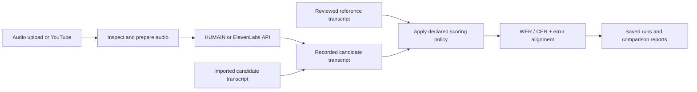

<div align="center">

# ASR Evaluation
### Measure transcription quality. Inspect errors. Compare like-for-like.

**Python · Flask · Speech-to-Text Evaluation · WER / CER · Arabic / English**

A local-first workbench for evaluating speech-to-text outputs against a reference, with explainable word/character errors, comparable model scorecards, and exportable results.

[](https://github.com/momaoalo/ASR-Evaluation/actions/workflows/windows-setup-smoke.yml)

[**Quick start**](#quick-start) · [**Methodology**](#how-scoring-works) · [**Architecture**](docs/ARCHITECTURE.md) · [**Windows guide**](docs/WINDOWS_SETUP.md) · [**العربية**](README_AR.md)

</div>

---


*Example exported dashboard with **synthetic English transcripts**. The displayed scores are for demonstration only, **not** measured HUMAIN or ElevenLabs accuracy. [Inspect the example data](examples/portfolio/README.md).*

## The problem and approach

Speech recognition output needs more than a single accuracy percentage. A trustworthy comparison requires the **same audio**, a reviewed **reference transcript**, a documented **normalization policy**, and explicit treatment of **failed calls and repeated runs**.

This project brings those steps into one local application. It is an **ASR evaluation tool**, not a trained ASR model, a speech recognizer of its own, or a medical/clinical validation system.

### What it implements

| Area | Implementation |
|---|---|
| Audio inputs | Local uploads, YouTube links (subject to availability), and JSON batch manifests |
| ASR integrations | HUMAIN Voice via its Python SDK; ElevenLabs Scribe v2 via API |
| Text-only analysis | Score imported or example transcripts **without** calling a provider |
| Error analysis | Word Error Rate (WER), Character Error Rate (CER), word substitutions / deletions / insertions, and positional alignments |
| Arabic-aware comparisons | Configurable text normalization and clearly separated **Cleaning / No cleaning** views |
| Fairer comparisons | Shared successful test cases, per-case metrics, macro averages, corpus-weighted metrics; unsuccessful runs remain failures |
| Traceability | Original transcripts, model settings, audio fingerprints, cached/live provenance, and persisted run outcomes |
| Review and reports | Reference review/re-scoring, interactive saved runs, portable HTML, JSON, and CSV exports |

## Evaluation workflow



The HUMAIN adapter uses the SDK's **FastTranscriptionClient**, intended for completed, latency-sensitive short audio units; it is not a generic long-meeting batch API. Upload/clip length is also restricted by application settings. Provider requests are **sequential**, not parallel. Imported transcripts follow a separate path and must **never** be interpreted as new API results. This distinction is displayed in the interface and saved provenance.

## Quick start

### Windows

Install [Python 3.12](https://www.python.org/downloads/), Git, and then in **PowerShell**:

```powershell
cd "$env:USERPROFILE\Documents"
git clone https://github.com/momaoalo/ASR-Evaluation.git
cd .\ASR-Evaluation
.\SETUP_WINDOWS.bat
.\START_WINDOWS.bat
```

The launcher uses a project-local `.venv`. Open **http://127.0.0.1:5000**. You do not need to activate Python manually.

**For live audio**, install FFmpeg and FFprobe. The repository includes a portable installer that also sets up Deno for YouTube use **without WinGet**:

```powershell
.\INSTALL_MEDIA_WINDOWS.bat
.\START_WINDOWS.bat
```

If you have an existing clone, use `git pull --ff-only` followed by `SETUP_WINDOWS.bat`. For errors such as missing `waitress`, `yt-dlp`, FFmpeg, or broken WinGet (`0x80073cfc`), see the **[step-by-step Windows setup and troubleshooting guide](docs/WINDOWS_SETUP.md)**.

### macOS / Linux

```bash
git clone https://github.com/momaoalo/ASR-Evaluation.git
cd ASR-Evaluation
python3 -m venv .venv
.venv/bin/python -m pip install -r requirements.txt
.venv/bin/python run_local.py
```

Install FFmpeg/FFprobe with your system package manager for live audio; a supported JavaScript runtime is recommended for YouTube acquisition. The web server is deliberately bound to loopback.

## Try it

**No API key:** use **New evaluation → Saved text demo → View sample results**, or import your own two transcripts. The bundled Arabic transcripts are historical supplied text. The first candidate's actual underlying model is **unknown**; it is **not** attributed to HUMAIN. The public repository does **not** include the original sample MP3.

**Actual API evaluation:** choose **New evaluation → Upload** (or YouTube URL), supply and confirm Ground Truth for that exact recording, select HUMAIN Voice and/or ElevenLabs, open **Model connections**, and provide your own keys. HUMAIN needs an account-specific API endpoint. Make sure **Use supplied transcripts** is off and confirm the provider-consent checkbox.

Provider access, billing and compatibility cannot be proven by mock tests. A live evaluation may consume credits. You can select a single provider while configuring the other. **No credentials or user recordings are included in this repository.**

## How scoring works

For each reference and hypothesis:

```text
WER = (word substitutions + deletions + insertions) / reference word count
CER = character edit distance / reference character count
```

- **Cleaning** applies the same declared normalization policy to reference and candidate; **No cleaning** retains a separately documented raw-baseline preparation. Neither changes the original saved provider response.
- **Average** is the unweighted mean across cases; **Corpus** divides summed edits by summed reference units. They can differ substantially.
- **Paired comparisons** use matching inputs/references/configuration where **both** selected models succeeded. Failed outputs are not scored as 0% WER, and duplicate attempts do not get extra weighting.
- A low WER/CER does **not** establish semantic or clinical accuracy or general superiority of any provider.

See [normalization](docs/NORMALIZATION_POLICY.md), [dashboard metrics](docs/DASHBOARD_1_6_2.md), and [data provenance](docs/portfolio/DATA_AND_PROVENANCE.md) for definitions and limitations.

## Implementation and verification

```text
app.py + run_local.py       Flask API and local server
pipeline.py + jobs.py       Request validation, sequential jobs, and checkpoints
services/                  Media acquisition, conversion, provider adapters
evaluation/                Text normalization, edit alignments, WER/CER, aggregation
storage.py                 Atomic JSON persistence
reporting*.py              Results, review and exports
templates/ + static/       Web UI and visualizations
tests/                     Unit/integration and offline provider-mock tests
docs/ + verification/      Contracts and historical verification records
```

<details>
<summary><strong>What has actually been verified?</strong></summary>

- A [Windows Python 3.12 onboarding CI workflow](.github/workflows/windows-setup-smoke.yml) installs the project, checks portable media tools and source/UI integrity, runs the **full available offline unit/integration suite as a required check**, and exercises first-run flows with **mocked** provider responses.
- **Public-clone Windows regression baseline (9 October 2026): 416 tests run, 412 passed and 4 explicitly skipped; 0 failures/errors.** The skipped tests require the non-redistributed original audio fixture. [Inspect the CI evidence](https://github.com/momaoalo/ASR-Evaluation/actions/runs/37874546133). These results do not include paid provider inference.
- The first-run smoke tests verify that a supplied transcript can create saved scores and that a mocked API run is queued/saved without leaking a test credential.
- A previous historical offline test run is documented separately in [verification evidence](docs/portfolio/VERIFICATION.md), with skipped tests and fixture requirements declared.
- **Not verified by CI:** real paid provider credentials/endpoints, actual provider model accuracy, unrestricted YouTube downloads, or medical suitability.

</details>

**Scope and origin:** This repository presents and maintains an earlier ASR Evaluator Dashboard 1.6.2 application for a technical portfolio, including setup repairs, integration wiring, tests, and documentation. Historical archived materials are identified as such; see [source and migration context](docs/portfolio/MIGRATION.md). Provider names do not imply endorsement or an official company release.

**Privacy:** run locally, only process audio you are authorized to use, and keep `.env`, `config.local.json`, `data/` and any patient or company-private data out of Git. See [SECURITY.md](SECURITY.md). **No general reuse license has been granted** for the repository contents; third-party materials retain their terms.

## Technical references

[Architecture](docs/ARCHITECTURE.md) · [Provider configuration](docs/portfolio/CONFIGURATION.md) · [Data provenance](docs/portfolio/DATA_AND_PROVENANCE.md) · [Verification scope](docs/portfolio/VERIFICATION.md) · [Function map (historical)](docs/FUNCTION_MAP.md) · [Sources](docs/SOURCES.md)
