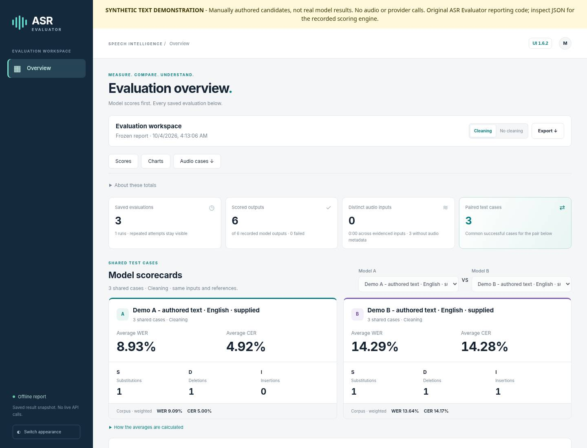
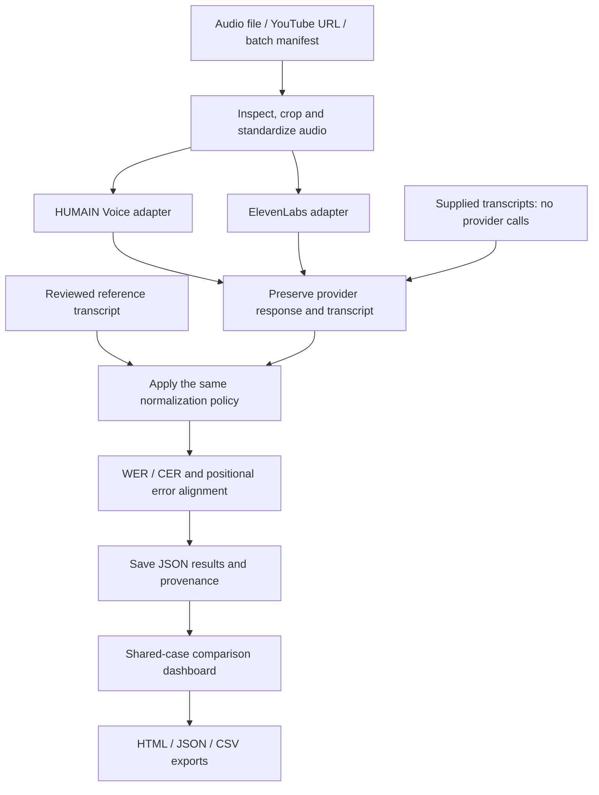

<div align="center">

# ASR Evaluation
### Compare transcripts. Understand errors. Trace every score.

**Python · Flask · WER / CER · Arabic / English / Mixed-language text**

A local-first evaluation workspace for speech-to-text systems, combining reproducible scoring, error alignment, model comparisons, and portable reports.

[Quick start](#quick-start) · [How it works](#how-it-works) · [Technical architecture](docs/ARCHITECTURE.md) · [Methodology](#evaluation-methodology) · [Verification](docs/portfolio/VERIFICATION.md)

</div>

---



*Actual exported-report interface, populated with explicitly synthetic English examples. Demo A and Demo B are authored candidate texts, not real model results. [Inspect the example](examples/portfolio/README.md).* 

## What this project does

ASR Evaluation brings the steps around speech recognition into one inspectable workflow: prepare an audio input, obtain or import transcripts, compare them with a reviewed reference, analyze the differences, and save the evidence behind the result.

It is an **evaluation tool**, not a speech-recognition model or a clinical decision system. The original application source comes from **ASR Evaluator Dashboard 1.6.2**. This portfolio packaging preserves its implementation rather than replacing it with a smaller WER calculator.

| Capability | Implemented behavior |
|---|---|
| Input workflows | Local audio, YouTube URLs, batch manifests, and supplied transcripts |
| Provider adapters | HUMAIN Voice SDK and ElevenLabs speech-to-text API |
| Two scoring views | Original raw-baseline policy and normalized/cleaning policy |
| Error analysis | Independent word/character alignments, substitutions, deletions, insertions, and source spans |
| Comparison dashboard | Shared-case comparisons, macro averages, corpus metrics, per-case inspectors, and saved runs |
| Reference review | Confirm, exclude, or explicitly correct a reference and re-score saved text without another ASR request |
| Portable reports | Self-contained HTML snapshots, JSON exports, and CSV tables |
| Traceability | Input fingerprints, normalization policies, provider configuration, errors, and run metadata |

## How it works



The two provider branches represent separate adapters, **not concurrent inference**. The original worker processes cases and providers sequentially. Raw text is retained; normalization does not rewrite the underlying provider response.

## Quick start

### 1. Clone and install

Python **3.12** is the original recommended version. Keep the repository structure intact: application templates and scripts are protected by an integrity manifest.

```bash
git clone https://github.com/momaoalo/ASR-Evaluation.git
cd ASR-Evaluation
python -m venv .venv
```

Activate the environment:

```bash
# Windows PowerShell
.venv\Scripts\Activate.ps1

# macOS / Linux
source .venv/bin/activate
```

Install the original dependencies:

```bash
python -m pip install -r requirements.txt
```

For a local transcript-scoring setup without the optional HUMAIN SDK, use the additional minimal requirements file:

```bash
python -m pip install -r requirements-offline.txt
```

No GPU or local model weights are required: live ASR uses provider APIs; supplied-transcript evaluation runs locally.

### 2. Start the application

```bash
python run_local.py
```

Open **http://127.0.0.1:5000**. The launcher uses Waitress and opens the browser. Existing Windows shortcuts, including `SETUP_WINDOWS.bat` and `START_WINDOWS.bat`, are preserved.

### 3. Try scoring without API keys

Use the application's supplied-transcript workflow or its saved sample transcripts. Provide a reference and candidate transcripts, then inspect the raw/cleaning views and individual edits. This path does **not** call a provider.

A separate synthetic English example is available under [`examples/portfolio`](examples/portfolio/README.md). Its candidate outputs are deliberately authored examples, **not recorded results from real ASR models**.

**Sample audio:** the original `examples/doctor_clip.mp3` is a separate media fixture. Transcript-only scoring does not need it; playback, processing the pinned sample, and some original regression tests do. See [media and sample provenance](docs/portfolio/DATA_AND_PROVENANCE.md) before running those paths. The full local delivery bundle retains this original fixture.

### 4. Enable live ASR only when needed

Copy `.env.example` to `.env`, then configure your own provider credentials and account endpoint. Never paste real keys into repository files or commit local configuration.

The original HUMAIN adapter selects its model from the language mode: Arabic, English, or mixed. Merely setting `HUMAIN_MODEL` in the example file does not override that adapter mapping. See [`docs/portfolio/CONFIGURATION.md`](docs/portfolio/CONFIGURATION.md).

Live processing requires **FFmpeg / FFprobe**. YouTube acquisition additionally uses **yt-dlp** and its supported JavaScript runtime configuration. These programs are separate from the original Python requirements.

A live request sends audio to the selected provider and may use account credits. Reference text is used for scoring, not as a hint sent to the ASR service.

## Evaluation methodology

### Word and character error rates

For a nonempty reference:

```text
WER = (word substitutions + word deletions + word insertions) / reference words
CER = character edit count / reference characters
```

The implementation uses **JiWER**, with an explicitly identified **RapidFuzz fallback** when JiWER is unavailable. Engine information is recorded in results.

Words are whitespace-delimited. Characters are Unicode code points; whether spaces count is a saved policy setting. Rates can exceed 100% and are not clamped. Technical failures remain failures, not invented zero-error results.

### Raw does not mean unprocessed bytes

The original raw baseline performs declared formatting/whitespace preparation. The cleaning view additionally applies the saved normalization policy to both reference and prediction. The application retains original text and a change log.

Custom spelling equivalences produce **policy-specific** scores. They are not interchangeable with literal-spelling WER. A lower score after cleaning is not evidence that the ASR model itself improved.

### Average versus corpus results

- **Average WER/CER:** arithmetic mean of per-case rates on the selected shared subset.
- **Corpus WER/CER:** total edits divided by total reference units on that subset.

For example, one error in a 10-word case and 50 errors in a 100-word case produce **30% average WER** but **46.36% corpus WER**. Both values are meaningful; they answer different questions.

Provider comparisons use common successful cases with compatible reference/scoring settings. A missing comparison is displayed as unavailable, not perfect performance. See [`docs/DASHBOARD_1_6_2.md`](docs/DASHBOARD_1_6_2.md) for the original scorecard definitions.

## Repository map

```text
ASR-Evaluation/
├── app.py                   Local Flask routes and request boundary
├── run_local.py             Waitress launcher and UI consistency checks
├── pipeline.py              Validation and per-case orchestration
├── jobs.py                  Persistent job queue and worker
├── config.py                Local application settings
├── services/                Audio acquisition / preparation / provider adapters
├── evaluation/              Normalization, alignment, metrics and aggregation
├── storage.py               JSON persistence and result indexing
├── reporting.py             Standalone HTML, JSON and CSV reporting
├── reporting_review.py      Explicit reference review and local re-scoring
├── templates/               Original English application templates
├── static/                  Original CSS, JavaScript and native SVG charts
├── examples/                Original sample metadata and additional synthetic examples
├── tests/                   Original regression suite
├── docs/                    Architecture, policies, function map and portfolio notes
├── tools/                   UI-manifest tooling and source verification
└── verification/            Clearly dated historical and migration evidence
```

The original Arabic setup notes are retained as legacy material. The main README and portfolio documentation are in English. Arabic sample text is intentionally not translated because changing a reference would change the evaluation.

## Verification status

The recovered package passed its original **SHA-256 package verification** before changes to packaging. A fresh offline run on 4 October 2026 discovered **407 tests: 372 passed, 35 skipped, 0 failures, 0 errors**.

The skipped tests require unavailable Flask or JiWER installations. Scoring tests used the implementation's existing RapidFuzz fallback. The environment could not install the missing packages because network name resolution failed. Therefore this is **not a complete Flask integration pass**, a fresh JiWER parity pass, or a live-provider validation.

```bash
# Verify preserved application source, allowing the separately distributed audio fixture
python tools/verify_source.py

# Full original test suite: install dependencies and restore the original media fixture first
python run_tests.py

# Original full-package check also requires the original sample MP3
python verify_package.py
```

See [verification details](docs/portfolio/VERIFICATION.md) for exact scope and exclusions. Historical reports are retained as historical evidence, never relabeled as new tests.

## Limits and safe use

This is a **single-user local workstation application**, not a hosted multi-user service. It has no account system or distributed queue. Keep it on loopback; do not expose it to the public internet.

A WER/CER score measures textual differences relative to the chosen reference. It does not establish semantic correctness, medical safety, SOAP-note quality, or a universal ranking of ASR providers. Reference quality, normalization policy, sample selection, and model-version provenance all matter.

Local settings are plaintext. Keep `.env`, `config.local.json`, uploaded audio, provider responses, and private run history out of Git. See [security guidance](SECURITY.md).

## Documentation

- [Architecture and implementation contracts](docs/ARCHITECTURE.md)
- [Actual function map](docs/FUNCTION_MAP.md)
- [Normalization policy](docs/NORMALIZATION_POLICY.md)
- [Dashboard 1.6.2 definitions](docs/DASHBOARD_1_6_2.md)
- [Configuration and provider setup](docs/portfolio/CONFIGURATION.md)
- [Data and provenance](docs/portfolio/DATA_AND_PROVENANCE.md)
- [Migration and source preservation](docs/portfolio/MIGRATION.md)
- [Verification evidence](docs/portfolio/VERIFICATION.md)
- [Original primary technical sources](docs/SOURCES.md)

Provider names identify integrations only; this repository does not imply endorsement or an official company release. No new project license has been selected as part of this migration; third-party code and media retain their own terms.
