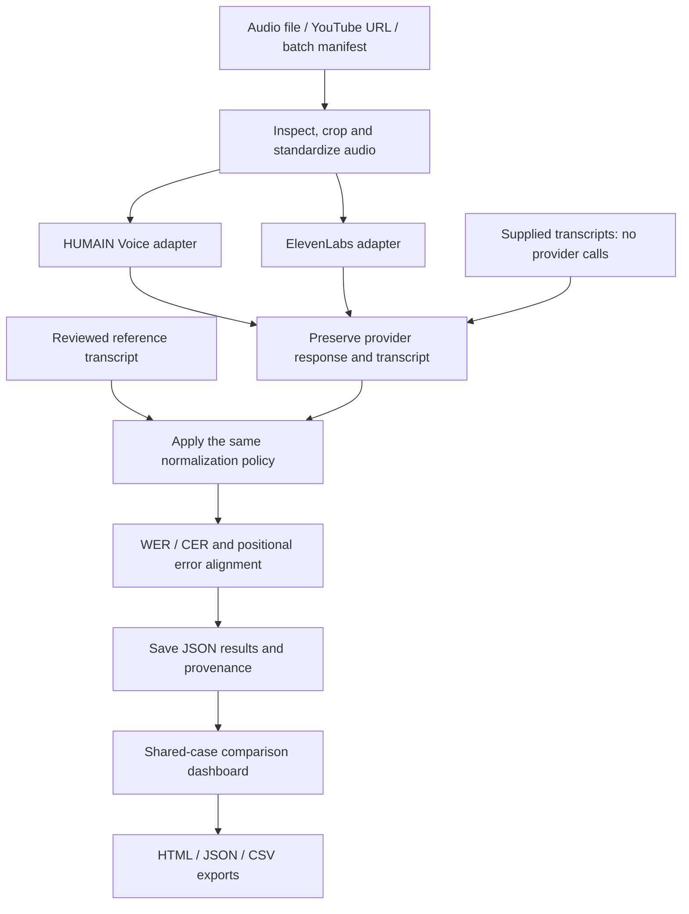

<div align="center">

# ASR Evaluation
### Compare transcripts. Understand errors. Trace every score.

**Python · Flask · WER / CER · Arabic / English / Mixed-language text**

A local-first evaluation workspace for speech-to-text systems, combining reproducible scoring, error alignment, model comparisons, and portable reports.

[Quick start](#quick-start) · [How it works](#how-it-works) · [Technical architecture](docs/ARCHITECTURE.md) · [Methodology](#evaluation-methodology) · [Verification](docs/portfolio/VERIFICATION.md)

</div>

---


*Actual exported-report interface, populated with explicitly synthetic English examples. Demo A and Demo B are authored candidate texts, not real model results. [Inspect the example](examples/portfolio/README.md).* 

## What this project does

ASR Evaluation brings the steps around speech recognition into one inspectable workflow: prepare an audio input, obtain or import transcripts, compare them with a reviewed reference, analyze the differences, and save the evidence behind the result.

It is an **evaluation tool**, not a speech-recognition model or a clinical decision system. The original application source comes from **ASR Evaluator Dashboard 1.6.2**. This portfolio packaging preserves its implementation rather than replacing it with a smaller WER calculator.

| Capability | Implemented behavior |
|---|---|
| Input workflows | Local audio, YouTube URLs, batch manifests, and supplied transcripts |
| Provider adapters | HUMAIN Voice SDK and ElevenLabs speech-to-text API |
| Two scoring views | Original raw-baseline policy and normalized/cleaning policy |
| Error analysis | Independent word/character alignments, substitutions, deletions, insertions, and source spans |
| Comparison dashboard | Shared-case comparisons, macro averages, corpus metrics, per-case inspectors, and saved runs |
| Reference review | Confirm, exclude, or explicitly correct a reference and re-score saved text without another ASR request |
| Portable reports | Self-contained HTML snapshots, JSON exports, and CSV tables |
| Traceability | Input fingerprints, normalization policies, provider configuration, errors, and run metadata |

## How it works



The two provider branches represent separate adapters, **not concurrent inference**. The original worker processes cases and providers sequentially. Raw text is retained; normalization does not rewrite the underlying provider response.

## Quick start

### Windows (PowerShell) — recommended

Use **Python 3.12** when available; the Windows setup script can also use another installed Python 3 version. **Do not clone or run the project from `C:\Windows\System32`**. Run these commands in a normal PowerShell window:

```powershell
cd "$env:USERPROFILE\Documents"
git clone https://github.com/momaoalo/ASR-Evaluation.git
cd .\ASR-Evaluation
.\SETUP_WINDOWS.bat
.\START_WINDOWS.bat
```

The setup script creates **`.venv` inside the repository** and installs all Python packages (including Waitress, HUMAIN Voice and **`yt-dlp[default]`**). It does not install system tools or alter your global Python. The start script consistently uses **`.venv\Scripts\python.exe`**; no PowerShell execution-policy change or environment activation is required.

If you previously cloned this project, for example as **`ASR-Evaluation-Test`**, update and reinstall its Python dependencies after pulling new changes:

```powershell
cd "$env:USERPROFILE\Documents\ASR-Evaluation-Test"
git pull --ff-only
.\SETUP_WINDOWS.bat
.\START_WINDOWS.bat
```

If you prefer manual commands, use the venv's Python explicitly:

```powershell
.\.venv\Scripts\python.exe -m pip install -r requirements.txt
.\.venv\Scripts\python.exe diagnose.py
.\.venv\Scripts\python.exe run_local.py
```

Open <http://127.0.0.1:5000> (the launcher also attempts to open your browser). Keep the PowerShell window open while using the app. If another ASR process is already on port 5000, stop that one with **Ctrl+C** before starting a different clone.

### Extra tools for real audio and YouTube

**WinGet alternative (including error `0x80073cfc`):** run the included portable media installer instead of WinGet:

```powershell
.\INSTALL_MEDIA_WINDOWS.bat
```

This downloads the [FFmpeg Essentials Windows build](https://www.gyan.dev/ffmpeg/builds/) and [Deno's Windows release](https://github.com/denoland/deno/releases) from their official distributions, verifies published SHA-256 checksums, and installs them under the ignored project-local `.tools/` directory. No administrator privileges, global PATH changes, or separate package manager required. The project launcher finds these tools automatically. You can review `INSTALL_MEDIA_WINDOWS.ps1` before running it. To install FFmpeg without optional Deno, run `powershell -NoProfile -ExecutionPolicy Bypass -File .\INSTALL_MEDIA_WINDOWS.ps1 -SkipDeno`.

If you want to repair WinGet on Windows 11, Microsoft's documented command is `Get-AppxPackage Microsoft.DesktopAppInstaller | Reset-AppxPackage`, followed by `winget source update`.

Python packages alone are **not sufficient** to convert audio. For live ASR via Upload or YouTube, install **FFmpeg/FFprobe** using Windows Package Manager:

```powershell
winget install -e --id Gyan.FFmpeg
```

For YouTube, **Deno 2.3+** is recommended by yt-dlp to process YouTube's JavaScript challenges:

```powershell
winget install -e --id DenoLand.Deno
```

Close and reopen PowerShell after installing tools, then check them:

```powershell
ffmpeg -version
ffprobe -version
deno --version
.\.venv\Scripts\python.exe -m yt_dlp --version
.\.venv\Scripts\python.exe diagnose.py
```

The app runs yt-dlp using the **same Python environment** as the server, so installing it with pip is enough; it does not require a separate global `yt-dlp.exe`. Some YouTube videos remain restricted or unavailable even with these tools. Use **Upload** for a local recording when downloading is not possible. Only download media you have permission to use.

### Demo vs. live ASR (important)

- **View sample results / Supplied transcripts:** compares previously provided transcript texts **locally**. **No API request**, no new provider result, no billable usage. The first historical example transcript has **unverified model identity**; it is **not** a HUMAIN result. This public GitHub checkout **does not include** the original `examples/doctor_clip.mp3` media fixture.
- **Live comparison:** choose **Upload** or **YouTube URL**, provide a reviewed Ground Truth for that exact audio, select HUMAIN Voice and/or ElevenLabs, and open **Model connections** to enter your own API keys. HUMAIN also needs your account's correct API endpoint. Disable **Use supplied transcripts**. Check consent before running: audio will be sent to the selected providers and may incur charges.

The ElevenLabs endpoint is fixed by its adapter. API keys entered in the interface are used for the active run; do not share or commit real keys. A provider can fail even with configured keys if account access, endpoint or quota is unavailable. Failed calls are shown as failures, **not zero WER**.

### macOS / Linux

```bash
git clone https://github.com/momaoalo/ASR-Evaluation.git
cd ASR-Evaluation
python3 -m venv .venv
.venv/bin/python -m pip install -r requirements.txt
.venv/bin/python run_local.py
```

Install FFmpeg and, for YouTube, a supported JavaScript runtime (Deno recommended) using your OS package manager. The application listens on loopback only.

### Checks and troubleshooting

- `No module named 'waitress'`: you ran a Python interpreter without project dependencies. Use **`.venv\Scripts\python.exe`** or rerun `SETUP_WINDOWS.bat`.
- `yt-dlp was not found`: pull the updated repository and run **`SETUP_WINDOWS.bat`**; `yt-dlp[default]` is now installed in the venv. If YouTube still fails, verify Deno and try Upload.
- `FFmpeg/FFprobe is not installed`: install FFmpeg (including FFprobe) and reopen the shell.
- `Incomplete application files`: run `git status` and `git pull --ff-only` on a clean checkout. The tracked `.gitattributes` forces LF for checksum-protected UI files; do not regenerate the manifest unless you've intentionally changed the UI.
- Run **`.\\.venv\\Scripts\\python.exe verify_package.py`** to check the current Git checkout's required files and UI hashes. Use `--full-release` only for the historical complete ZIP, whose original checksums and private media are not expected in this repository.
- A saved **`supplied`** run does not prove an API key was used. Check run provenance for **`live`** before claiming real provider benchmarking.

```powershell
.\.venv\Scripts\python.exe diagnose.py
.\.venv\Scripts\python.exe -c "from ui_integrity import verify_ui_files; from pathlib import Path; print(verify_ui_files(Path.cwd()))"
```

An empty list `[]` means the checked UI files match the manifest. Diagnostics do not make paid API requests. Some historical regression tests require the separately distributed audio fixture; do not interpret their missing-file failures as ASR inference failures.

## Evaluation methodology

### Word and character error rates

For a nonempty reference:

```text
WER = (word substitutions + word deletions + word insertions) / reference words
CER = character edit count / reference characters
```

The implementation uses **JiWER**, with an explicitly identified **RapidFuzz fallback** when JiWER is unavailable. Engine information is recorded in results.

Words are whitespace-delimited. Characters are Unicode code points; whether spaces count is a saved policy setting. Rates can exceed 100% and are not clamped. Technical failures remain failures, not invented zero-error results.

### Raw does not mean unprocessed bytes

The original raw baseline performs declared formatting/whitespace preparation. The cleaning view additionally applies the saved normalization policy to both reference and prediction. The application retains original text and a change log.

Custom spelling equivalences produce **policy-specific** scores. They are not interchangeable with literal-spelling WER. A lower score after cleaning is not evidence that the ASR model itself improved.

### Average versus corpus results

- **Average WER/CER:** arithmetic mean of per-case rates on the selected shared subset.
- **Corpus WER/CER:** total edits divided by total reference units on that subset.

For example, one error in a 10-word case and 50 errors in a 100-word case produce **30% average WER** but **46.36% corpus WER**. Both values are meaningful; they answer different questions.

Provider comparisons use common successful cases with compatible reference/scoring settings. A missing comparison is displayed as unavailable, not perfect performance. See [`docs/DASHBOARD_1_6_2.md`](docs/DASHBOARD_1_6_2.md) for the original scorecard definitions.

## Repository map

```text
ASR-Evaluation/
├── app.py                   Local Flask routes and request boundary
├── run_local.py             Waitress launcher and UI consistency checks
├── pipeline.py              Validation and per-case orchestration
├── jobs.py                  Persistent job queue and worker
├── config.py                Local application settings
├── services/                Audio acquisition / preparation / provider adapters
├── evaluation/              Normalization, alignment, metrics and aggregation
├── storage.py               JSON persistence and result indexing
├── reporting.py             Standalone HTML, JSON and CSV reporting
├── reporting_review.py      Explicit reference review and local re-scoring
├── templates/               Original English application templates
├── static/                  Original CSS, JavaScript and native SVG charts
├── examples/                Original sample metadata and additional synthetic examples
├── tests/                   Original regression suite
├── docs/                    Architecture, policies, function map and portfolio notes
├── tools/                   UI-manifest tooling and source verification
└── verification/            Clearly dated historical and migration evidence
```

The original Arabic setup notes are retained as legacy material. The main README and portfolio documentation are in English. Arabic sample text is intentionally not translated because changing a reference would change the evaluation.

## Verification status

The recovered package passed its original **SHA-256 package verification** before changes to packaging. A fresh offline run on 4 October 2026 discovered **407 tests: 372 passed, 35 skipped, 0 failures, 0 errors**.

The skipped tests require unavailable Flask or JiWER installations. Scoring tests used the implementation's existing RapidFuzz fallback. The environment could not install the missing packages because network name resolution failed. Therefore this is **not a complete Flask integration pass**, a fresh JiWER parity pass, or a live-provider validation.

```bash
# Verify preserved application source, allowing the separately distributed audio fixture
python tools/verify_source.py

# Full original test suite: install dependencies and restore the original media fixture first
python run_tests.py

# Original full-package check also requires the original sample MP3
python verify_package.py
```

See [verification details](docs/portfolio/VERIFICATION.md) for exact scope and exclusions. Historical reports are retained as historical evidence, never relabeled as new tests.

## Limits and safe use

This is a **single-user local workstation application**, not a hosted multi-user service. It has no account system or distributed queue. Keep it on loopback; do not expose it to the public internet.

A WER/CER score measures textual differences relative to the chosen reference. It does not establish semantic correctness, medical safety, SOAP-note quality, or a universal ranking of ASR providers. Reference quality, normalization policy, sample selection, and model-version provenance all matter.

Local settings are plaintext. Keep `.env`, `config.local.json`, uploaded audio, provider responses, and private run history out of Git. See [security guidance](SECURITY.md).

## Documentation

- [Architecture and implementation contracts](docs/ARCHITECTURE.md)
- [Actual function map](docs/FUNCTION_MAP.md)
- [Normalization policy](docs/NORMALIZATION_POLICY.md)
- [Dashboard 1.6.2 definitions](docs/DASHBOARD_1_6_2.md)
- [Configuration and provider setup](docs/portfolio/CONFIGURATION.md)
- [Data and provenance](docs/portfolio/DATA_AND_PROVENANCE.md)
- [Migration and source preservation](docs/portfolio/MIGRATION.md)
- [Verification evidence](docs/portfolio/VERIFICATION.md)
- [Original primary technical sources](docs/SOURCES.md)

Provider names identify integrations only; this repository does not imply endorsement or an official company release. No new project license has been selected as part of this migration; third-party code and media retain their own terms.
